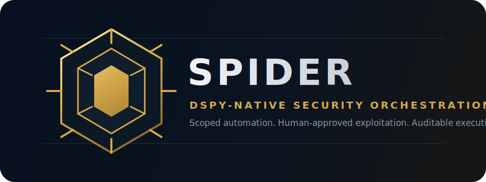

<p align="center">
  
</p>

<h1 align="center">SPIDER</h1>

<p align="center">
  <strong>Symbiotic Pentesting Investigation & DSPy Exploitation Runtime</strong>
</p>

<p align="center">
  A local-first, DSPy-native security orchestration platform for authorized
  penetration testing, structured attack-path reasoning, and auditable tool
  execution.
</p>

<p align="center">
  <a href="#quick-start">Quick Start</a> ·
  <a href="#architecture">Architecture</a> ·
  <a href="#safety-model">Safety Model</a> ·
  <a href="#development">Development</a>
</p>

> [!WARNING]
> SPIDER is for authorized penetration testing and security research only.
> Do not scan, exploit, or enumerate systems without explicit written
> authorization. Exploitation and post-exploitation workflows are designed to be
> human-approved, scoped, sandboxed, and audited.

## Product Positioning

SPIDER is designed for security teams that need automation without surrendering
control. It treats every assessment as a governed workflow: targets must be in
scope, tools are invoked through audited adapters, exploitation requires human
approval, and model outputs are validated as structured data.

The result is a premium operator experience for controlled offensive security:
local inference, explicit topology, typed findings, deterministic quality gates,
and a development model that favors traceability over opaque agent behavior.

## Platform Capabilities

| Capability | What it provides |
| ---------- | ---------------- |
| Structured reasoning | DSPy modules express recon, enumeration, analysis, planning, execution, and reporting as typed programs. |
| Governed automation | Scope guards, exclusions, HITL approval, sandboxing, and audit logging are built into the execution path. |
| High-fidelity outputs | Pydantic schemas keep findings, plans, and reports machine-readable instead of relying on ad hoc text parsing. |
| Parallel assessment flow | Independent graph nodes run in wave-based execution while preserving dependency order. |
| Local-first operation | Ollama-backed models keep core reasoning close to the operator environment. |
| Extensible tool layer | Security tools are registered through one adapter surface with consistent validation and logging. |

## Technical Differentiators

Most AI pentesting projects expose security tools as direct function calls and
leave the model to coordinate free-form text. SPIDER is built around DSPy
programs and typed schemas instead:

- **DSPy-native orchestration** with `dspy.ReAct`, `dspy.Predict`,
  `dspy.ChainOfThought`, and `dspy.Refine`.
- **Typed structured outputs** using Pydantic models shared through
  `src/spider/schemas.py`.
- **Wave-based execution** for running independent graph nodes in parallel.
- **Audited tool wrappers** registered through `src/spider/tools/adapter.py`.
- **Scope guard enforcement** before tool execution.
- **Human-in-the-loop gates** before exploitation or post-exploitation actions.
- **Local-first model setup** through Ollama, with optional external API keys for
  intelligence and fallback providers.

## Project Status

SPIDER is under active development. The repository includes the core engine,
node modules, tool wrappers, sandbox controls, TUI components, lab configuration,
and tests. Expect interfaces to change while the architecture is being hardened.

See the planning material in [`plan/`](plan/) and the long-form docs in
[`docs/`](docs/) for current design notes.

## Requirements

- Python 3.10+
- [`uv`](https://docs.astral.sh/uv/) for dependency and command execution
- Ollama for local LLM inference
- Docker for the sandbox and vulnerable test lab
- Security tools used by selected wrappers, such as `nmap`, `gobuster`, `ffuf`,
  `nikto`, `nuclei`, or `sqlmap`, depending on the scan mode

## Model Setup

The default configuration uses Qwen3.5 Abliterated through Ollama.

```bash
ollama pull huihui_ai/qwen3.5-abliterated:9b
ollama pull huihui_ai/qwen3.5-abliterated:4b
```

An optional [`Modelfile`](Modelfile) is included if you want a named local model
with SPIDER-specific defaults:

```bash
ollama create spider-qwen35 -f Modelfile
```

Then set `SPIDER_PRIMARY_MODEL=spider-qwen35` in `.env`.

## Quick Start

```bash
git clone https://github.com/Dan-StrategicAutomation/spider.git
cd spider

uv sync --all-extras
cp .env.example .env
```

Edit `.env` before running a scan. At minimum, set an explicit allowed target or
lab network:

```bash
SPIDER_ALLOWED_TARGETS=192.168.1.0/24
SPIDER_EXCLUDED_TARGETS=0.0.0.0,127.0.0.1,localhost
SPIDER_RULES_OF_ENGAGEMENT=No destructive actions without human approval.
```

Start Ollama, confirm the model is available, then launch SPIDER:

```bash
ollama list
uv run spider
```

For a safe first run, choose recon-only mode against a target you own or against
the local lab.

## Scan Modes

| Mode | Behavior |
| ---- | -------- |
| Recon only | Autonomous discovery and enumeration within the configured scope. |
| Full pentest | Recon, analysis, planning, and HITL-gated exploitation. |
| Custom goal | Natural-language objective translated into a DSPy graph topology. |

Recon and enumeration may run autonomously when the target is in scope.
Exploitation, payload delivery, and post-exploitation require explicit human
approval.

## Architecture

SPIDER executes assessments as a directed acyclic graph of DSPy modules:

```text
Recon (ReAct)
  -> Enumeration (parallel)
  -> Vulnerability Analysis
  -> Exploit Planning
  -> Exploitation (HITL-gated)
  -> Report
```

The orchestration flow is:

1. GraphWeaver builds a topology from the goal and scan mode.
2. The orchestrator provisions scoped tools through the central adapter.
3. GraphRunner executes nodes in dependency waves.
4. Reward functions evaluate structured outputs.
5. `dspy.Refine` retries model work when quality thresholds are not met.
6. Safety controls enforce scope, sandbox, HITL, and audit boundaries.

Key implementation areas:

| Area | Path |
| ---- | ---- |
| Engine and orchestration | [`src/spider/engine/`](src/spider/engine/) |
| DSPy node modules | [`src/spider/nodes/`](src/spider/nodes/) |
| Shared Pydantic schemas | [`src/spider/schemas.py`](src/spider/schemas.py) |
| Tool wrappers and adapter | [`src/spider/tools/`](src/spider/tools/) |
| Scope, HITL, sandbox, audit | [`src/spider/sandbox/`](src/spider/sandbox/) |
| Intelligence clients | [`src/spider/intelligence/`](src/spider/intelligence/) |
| Terminal UI | [`src/spider/tui/`](src/spider/tui/) |
| Local lab | [`lab/`](lab/) |

## Safety Model

SPIDER treats safety controls as part of the execution path, not documentation:

| Control | Purpose |
| ------- | ------- |
| Scope guard | Rejects targets outside `SPIDER_ALLOWED_TARGETS`. |
| Exclusions | Blocks explicitly excluded hosts and ranges. |
| HITL gate | Requires approval for exploitation and post-exploitation. |
| Sandbox | Runs supported tool execution in isolated Docker environments. |
| Audit log | Records tool invocation, target, parameters, and outcome. |
| Typed outputs | Prevents hidden string parsing from masking model failures. |

See [`docs/safety.md`](docs/safety.md) for the detailed safety design.

## Local Lab

The lab contains deliberately vulnerable targets for integration testing and
development.

```bash
docker compose -f lab/docker-compose.yml up -d
```

Only run integration tests against lab targets or systems where you have written
authorization.

## Development

Use `uv` for project commands.

```bash
# Run the full test suite
uv run pytest tests/ -q

# Run focused suites
uv run pytest tests/test_safety/ -q
uv run pytest tests/test_tools/ -q
uv run pytest tests/test_engine/ -q
uv run pytest tests/test_integration/ -q

# Lint and format
uv run ruff check src/ tests/
uv run ruff format src/ tests/
```

The development contract for AI agents and contributors is in
[`AGENTS.md`](AGENTS.md). In short: keep changes small, use Pydantic models for
structured DSPy data, register tools through the adapter, enforce scope before
execution, and add tests for behavior changes.

## Documentation

| Document | Contents |
| -------- | -------- |
| [`docs/quickstart.md`](docs/quickstart.md) | Setup and first run |
| [`docs/architecture.md`](docs/architecture.md) | System design and graph topology |
| [`docs/dspy-engine.md`](docs/dspy-engine.md) | Weaver, runner, refine, and evaluation |
| [`docs/tools.md`](docs/tools.md) | Tool catalog and adapter patterns |
| [`docs/safety.md`](docs/safety.md) | Scope guards, HITL, sandbox, and audit logging |
| [`docs/testing.md`](docs/testing.md) | Test strategy and lab setup |
| [`docs/tui.md`](docs/tui.md) | Terminal UI specification |
| [`docs/intelligence.md`](docs/intelligence.md) | CVE, KEV, EPSS, and exploit intelligence |
| [`plan/`](plan/) | Roadmap, review notes, and implementation plan |

## License

Apache License 2.0. See [`LICENSE`](LICENSE).

## Disclaimer

SPIDER is provided for lawful, authorized security testing only. The authors are
not responsible for misuse, unauthorized access, service disruption, data loss,
or other harm caused by improper operation. Always follow the rules of
engagement for the target environment and responsible disclosure practices.
